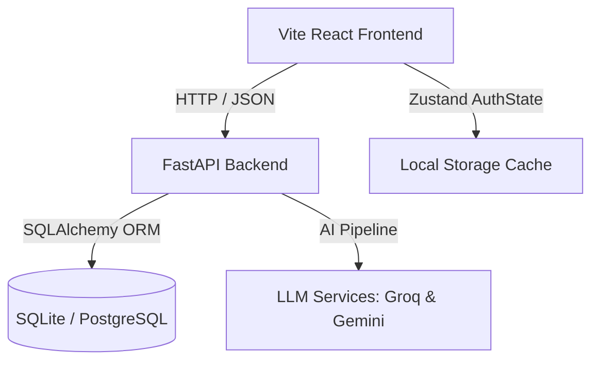

# ✈️ GlobeTrotter — Multi-City Travel Planner & AI Assistant

GlobeTrotter is a premium, end-to-end web application that empowers travelers to design, schedule, budget, and share detailed multi-city itineraries. Combining manual planning tools with an advanced **AI Travel Assistant**, GlobeTrotter turns dreams into structured schedules instantly.

---

## 🌟 Key Features

### 1. Dashboard & Workspace
* Get an overview of all active, upcoming, and past travel itineraries.
* Seamless navigation sidebar to toggle between active workspace modules and settings.

### 2. Custom Trip Creation
* Define trip titles, targets, Indian destination cities, dates, description goals, and beautiful Unsplash cover images.
* Form validation automatically guards required inputs.

### 3. AI Travel Assistant (Planner Assist)
* **Preference Inputs:** Provide origin location, budget range (min/max), travel style (budget, comfort, luxury), and select multiple interests (sightseeing, food, history, nature, adventure, shopping).
* **AI Generation Pipeline:** Utilizes Gemini and Groq model API endpoints to research coordinates, draft day-by-day stops, compile activities with schedules, and calculate itemized budget costs.
* **Degraded Fallback Mode:** Gracefully falls back to dynamic mock generation if LLM API keys are unconfigured, so developers can preview full multi-day plans without breaking the UI.

### 4. Interactive Itinerary Builder
* Organize and sequence destinations dynamically (supports drag-and-drop order updates).
* View stops chronologically, update dates, delete unwanted events, or click to add custom catalog activities.

### 5. Activity Catalog & Search
* Search a pre-seeded database of popular sightseeing tours, restaurant food tastings, transit steps, and bazaar walks.
* Filter results by city (e.g. Goa, Udaipur, Jaipur) and category tags.

### 6. Interactive Calendar Visualizer
* Displays all trip stops and scheduled activities mapped to a monthly/weekly grid layout (powered by `react-big-calendar`) for a clear timeline overview.

### 8. Real-Time Budget Breakdown
* Categorizes and compares total costs (activities, stays, flights, transit) using a clean pie-chart breakdown.
* Displays a warning banner at the top if expenses exceed the user-defined target budget.

### 9. Public Sharing & Copying
* Share your travel plan publicly with a single click. Unregistered users can view the read-only itinerary.
* Authenticated users can copy a shared trip to duplicate the entire itinerary structure into their workspace.

### 10. User Profile Settings & Security
* Update names, emails, avatar URLs, and security credentials.
* **Danger Zone:** Secure account deletion with double-confirmation, cascading deletion across all user-owned trips and sub-records.

---

## 🏗️ Architecture & Technology Stack

The project splits cleanly into a decoupled frontend and backend architecture:



### Frontend Stack
* **Vite + React:** Next-generation frontend tooling and rendering.
* **TypeScript:** Strict type safety across all interfaces.
* **Zustand:** Lightweight state store managing auth states.
* **Vanilla CSS:** Custom-tailored typography, dark mode toggles, and premium responsive grid designs.

### Backend Stack
* **FastAPI:** High-performance, asynchronous REST API.
* **SQLAlchemy:** Modern SQL toolkit and Object Relational Mapper.
* **AioSQLite / PostgreSQL:** Platform-independent async database models.
* **Pydantic:** Strictly enforced API schemas and request validation.

---

## 🚀 Quick Setup & Installation

### Local Execution (SQLite Environment)

#### 1. Backend Setup
1. Open a terminal in `/backend`:
   ```bash
   cd backend
   ```
2. Create and activate a Python virtual environment:
   ```bash
   python -m venv venv
   # On Windows:
   .\venv\Scripts\activate
   # On Unix/macOS:
   source venv/bin/activate
   ```
3. Install dependencies:
   ```bash
   pip install -r requirements.txt
   ```
4. Copy the environment file and configure variables:
   ```bash
   cp .env.example .env
   ```
5. Initialize and seed the database schema:
   ```bash
   python scripts/init_db.py
   ```
6. Start FastAPI:
   ```bash
   uvicorn app.main:app --reload --host 127.0.0.1 --port 8000
   ```

#### 2. Frontend Setup
1. Open a terminal in `/frontend`:
   ```bash
   cd frontend
   ```
2. Install npm packages:
   ```bash
   npm install
   ```
3. Run the development server:
   ```bash
   npm run dev -- --host 127.0.0.1 --port 5173
   ```
4. Visit `http://127.0.0.1:5173/` in your browser.

---

## 🧪 Testing Verification
Ensure database schemas and endpoint logic remain fully intact:
```bash
cd backend
pytest
```
*A suite of 64/64 automated tests covering accounts, sessions, trips, stops, and budgets is executed.*
